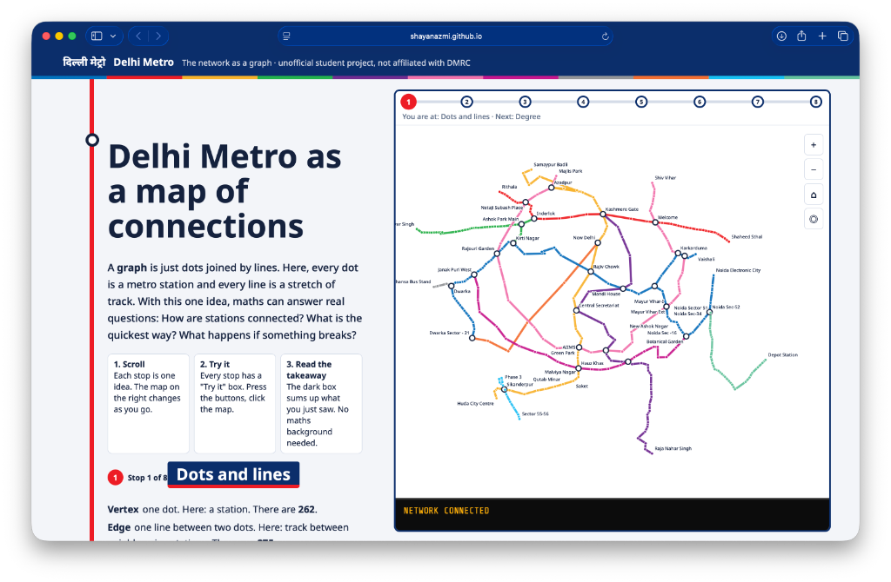

# 🚇 Delhi Metro as a Graph

> **An interactive, pedagogical graph theory analysis of the Delhi Metro transit network.**  
> Built as a Semester 5 Graph Theory Mini-Project (CIA-3).

🌐 **Live Interactive Website:** [https://shayanazmi.github.io/delhi_metro_as_graph/](https://shayanazmi.github.io/delhi_metro_as_graph/)

<p align="center">
  
</p>

---

## 📌 Overview

This project models the official **Delhi Metro network** as a finite, simple, undirected, weighted graph:

$$G = (V, E, w)$$

- **Vertices ($V$):** $262$ metro stations.
- **Edges ($E$):** $275$ physical track links connecting adjacent consecutive stations on timetabled trips.
- **Weights ($w$):** Median scheduled in-vehicle transit time (in seconds) derived from official General Transit Feed Specification (GTFS) data.
- **Interchange Link:** Includes the pedestrian transfer between Noida Sector 51 (Aqua Line) and Noida Sector 52 (Blue Line) with an assumed 5-minute (300 s) connection time.

The project translates graph algorithms and theorems into a self-contained, scroll-driven interactive visual experience powered by vanilla SVG and JavaScript with zero external libraries or build dependencies.

---

## 🧭 Interactive Chapters

The application is structured into **8 exploratory chapters**:

| Stop | Topic | Description & Algorithms |
| :--- | :--- | :--- |
| **1** | **Dots & Lines** | Definitions of vertices, edges, and subgraphs with line-by-line filtering. |
| **2** | **Degree & Connectivity** | Station degree distributions, local adjacency matrix extraction, and the **Handshake Lemma** ($\sum \deg(v) = 2\|E\|$). |
| **3** | **Finding the Way** | Comparative pathfinding: **BFS** (fewest stops), **Dijkstra** (quickest travel time), and **DFS** (exploratory search), plus automated divergence detection. |
| **4** | **Who Matters Most?** | Ranking stations by **Betweenness Centrality**, Degree, and Lines Served; comparing **Selection Sort** ($O(n^2)$) vs. **Merge Sort** ($O(n \log n)$). |
| **5** | **What if Something Breaks?** | Structural resilience, **Tarjan's algorithm** for Bridges ($122$) and Articulation Points ($117$), and stranded station analysis. |
| **6** | **The Skeleton** | Minimum Spanning Trees comparing **Kruskal's Algorithm** (Disjoint Set Union) and **Prim's Algorithm**; cyclomatic number ($14$ independent cycles). |
| **7** | **Challenges & Games** | Interactive shortest-path estimation game, single-closure maximum damage challenge, and **Eulerian/Hamiltonian** impossibility proofs. |
| **8** | **The Network Speaks** | Project case study, formal GTFS methodology, structural limitations, and an interactive 8-question self-assessment quiz. |

---

## 📊 Key Graph-Theoretic Metrics

| Metric | Measured Value | Theoretical Significance |
| :--- | :---: | :--- |
| **Total Vertices ($|V|$)** | `262` | Order of the graph (Metro stations) |
| **Total Edges ($|E|$)** | `275` | Size of the graph (Direct track connections) |
| **Connected Components** | `1` | Graph is fully connected ($2$ without the Aqua–Blue link) |
| **Handshake Lemma** | $\sum \deg(v) = 550$ | Exactly $2 \times 275 = 550$ |
| **Cyclomatic Number (Cycles)** | `14` | $\gamma = \|E\| - \|V\| + k = 275 - 262 + 1 = 14$ |
| **Spanning Tree Edges** | `261` | Exactly $\|V\| - 1 = 261$ edges |
| **Network Diameter** | `66 stops` | Longest shortest path: Brig. Hoshiyar Singh to Depot Station |
| **Bridges (Critical Links)** | `122` | Tracks whose failure disconnects the graph |
| **Articulation Points (Cut Vertices)** | `117` | Stations whose closure partitions the network |
| **Eulerian Trail Possible?** | ❌ **No** | $26$ vertices have odd degree ($> 2$) |
| **Hamiltonian Cycle Possible?** | ❌ **No** | $14$ stations are degree-1 dead ends |

### Top Hubs by Betweenness Centrality
1. **Kashmere Gate** ($C_B \approx 0.243$) — Major interchange of Red, Yellow & Violet lines.
2. **Dilli Haat – INA** ($C_B \approx 0.236$) — Key interchange connecting Yellow & Pink lines.
3. **Hauz Khas** ($C_B \approx 0.233$) — Southern hub linking Yellow & Magenta lines.
4. **Mayur Vihar-I** ($C_B \approx 0.230$) — Eastern transfer between Blue & Pink lines.
5. **Rajiv Chowk** ($C_B \approx 0.219$) — Central node connecting Blue & Yellow lines.

---

## 🛠️ Technology Stack & Design

- **Structure & Layout:** Clean semantic HTML5.
- **Styling:** Vanilla CSS3 with mobile-responsive flex/grid, modern color tokens matching DMRC line identities, and dark-mode terminal readouts.
- **Map Engine:** Procedural SVG engine with Mercator/radial declutter projections, vector line rendering, and custom pointer pan/zoom.
- **Algorithms:** Pure, zero-dependency JavaScript (ES6+) executing client-side graph algorithms:
  - Breadth-First Search (BFS)
  - Depth-First Search (DFS)
  - Dijkstra's Algorithm
  - Selection Sort & Merge Sort (with comparison tracing)
  - Tarjan's Bridge & Cut Vertex Algorithm
  - Kruskal's & Prim's Minimum Spanning Tree Algorithms

---

## 🚀 Running Locally

Because the project is completely self-contained in a single file with zero dependencies, running it locally requires no build steps or package managers:

```bash
# 1. Clone the repository
git clone https://github.com/shayanazmi/delhi_metro_as_graph.git
cd delhi_metro_as_graph

# 2. Open index.html directly in any modern browser
open index.html        # On macOS
# or start a simple local server
python3 -m http.server 8000
```
Then visit `http://localhost:8000` in your web browser.

---

## 📂 Repository Structure

```
.
├── index.html                   # Main production web application (clean, self-contained)
├── Delhi Metro as a graph (1).html # Original design reference
├── DELHI_METRO_DATA.csv         # Processed CSV dataset of Delhi Metro stations & edges
├── assets/                      # Application preview images & media
│   └── screenshot.png
├── data/                        # JSON metadata, connections & precomputed metrics
│   ├── connections.json
│   ├── graph_metrics.json
│   └── stations.json
├── metro/                       # Raw GTFS feed files (agency, calendar, routes, stops, trips)
├── .gitignore                   # System and workspace ignore patterns
└── README.md                    # Project documentation
```

---

## 📜 Limitations & Academic Disclaimer

- **Timetable Data:** Adjacency is derived strictly from consecutive stops in scheduled GTFS weekday trips.
- **In-Vehicle Times Only:** Journey calculations reflect scheduled train run times and do not model platform transfers, headway intervals, or station dwell times.
- **Unofficial Student Work:** This is an academic university project created for learning graph theory principles and is not officially affiliated with or endorsed by the Delhi Metro Rail Corporation (DMRC).

---

## 👤 Author

- **Shayan Azmi**  
- **Course:** Graph Theory (Semester 5) — Mini Project (CIA-3)
